# PeoplePay360 — Database Schema & RBAC Permissions Reference

**Version**: `0.0.5` (Phase 5: Time Off Management)  
**Database**: PostgreSQL 18+ (Async engine via `asyncpg`)  
**ORM**: SQLAlchemy 2.x  
**Migration Tool**: Alembic  

---

## 1. Entity Relationship Diagram (ERD)

```mermaid
erDiagram
    ROLES ||--o{ USERS : "assigned to"
    EMPLOYEES ||--o| USERS : "authenticated by (1:1)"
    DEPARTMENTS ||--o{ EMPLOYEES : "belongs to"
    JOB_POSITIONS ||--o{ EMPLOYEES : "holds"
    EMPLOYEES ||--o{ EMPLOYEES : "manages (manager_id)"
    EMPLOYEES ||--o{ CONTRACTS : "holds"
    DEPARTMENTS ||--o{ CONTRACTS : "assigned to"
    JOB_POSITIONS ||--o{ CONTRACTS : "designated as"
    WORKING_SCHEDULES ||--o{ WORKING_SCHEDULE_DAYS : "contains"
    WORKING_SCHEDULES ||--o{ EMPLOYEES : "governs (working_schedule_id)"
    EMPLOYEES ||--o{ ATTENDANCES : "records"
    TIME_OFF_TYPES ||--o{ TIME_OFF_ALLOCATIONS : "defines"
    TIME_OFF_TYPES ||--o{ TIME_OFF_REQUESTS : "categorizes"
    EMPLOYEES ||--o{ TIME_OFF_ALLOCATIONS : "receives"
    EMPLOYEES ||--o{ TIME_OFF_REQUESTS : "submits"
    TIME_OFF_ALLOCATIONS ||--o{ TIME_OFF_REQUESTS : "consumed by"

    ROLES {
        int id PK "autoincrement"
        varchar name UK "e.g. ADMIN, EMPLOYEE"
        varchar description "nullable"
        boolean is_active "default true"
        timestamptz created_at "default now()"
        timestamptz updated_at "default now()"
    }

    DEPARTMENTS {
        int id PK "autoincrement"
        varchar name UK "e.g. Engineering"
        varchar code UK "normalized uppercase e.g. ENG"
        varchar description "nullable"
        boolean is_active "default true"
        timestamptz created_at "default now()"
        timestamptz updated_at "default now()"
    }

    JOB_POSITIONS {
        int id PK "autoincrement"
        varchar name UK "e.g. Lead Software Engineer"
        varchar code UK "normalized uppercase e.g. LSE"
        varchar description "nullable"
        boolean is_active "default true"
        timestamptz created_at "default now()"
        timestamptz updated_at "default now()"
    }

    WORKING_SCHEDULES {
        int id PK "autoincrement"
        varchar name UK "e.g. Standard 40 Hours/Week"
        varchar calendar_type "default STANDARD"
        numeric hours_per_week "precision 5, scale 2"
        int days_per_week "default 5"
        boolean is_active "default true"
        timestamptz created_at "default now()"
        timestamptz updated_at "default now()"
    }

    WORKING_SCHEDULE_DAYS {
        int id PK "autoincrement"
        int schedule_id FK "-> working_schedules.id (CASCADE)"
        int day_of_week "0=Mon, 1=Tue, 2=Wed, 3=Thu, 4=Fri, 5=Sat, 6=Sun"
        time start_time "e.g. 09:00:00"
        time end_time "e.g. 18:00:00"
        int break_minutes "default 60"
        numeric work_hours "precision 4, scale 2, default 8.00"
    }

    EMPLOYEES {
        int id PK "autoincrement"
        varchar employee_code UK "e.g. EMP001"
        varchar first_name
        varchar last_name
        varchar email UK "work email"
        varchar phone "nullable"
        date date_of_birth "nullable"
        date joining_date
        int department_id FK "-> departments.id"
        int job_position_id FK "-> job_positions.id"
        int manager_id FK "-> employees.id (nullable)"
        int working_schedule_id FK "-> working_schedules.id (nullable)"
        employeestatus status "ACTIVE, INACTIVE, ON_LEAVE, TERMINATED"
        timestamptz created_at "default now()"
        timestamptz updated_at "default now()"
    }

    CONTRACTS {
        int id PK "autoincrement"
        varchar contract_number UK "e.g. CNT-2026-0001"
        int employee_id FK "-> employees.id"
        int department_id FK "-> departments.id"
        int job_position_id FK "-> job_positions.id"
        int salary_structure_id "nullable (future phase)"
        date start_date
        date end_date "nullable (permanent)"
        numeric wage "precision 12, scale 2"
        contractstatus status "DRAFT, RUNNING, EXPIRED, CANCELLED"
        timestamptz created_at "default now()"
        timestamptz updated_at "default now()"
    }

    ATTENDANCES {
        int id PK "autoincrement"
        int employee_id FK "-> employees.id"
        date attendance_date "UNIQUE with employee_id"
        timestamptz check_in
        timestamptz check_out "nullable"
        int worked_minutes "default 0"
        int late_minutes "default 0"
        int overtime_minutes "default 0"
        attendancestatus status "PRESENT, LATE, ABSENT, INCOMPLETE, HALF_DAY"
        boolean is_manual_edit "default false"
        varchar correction_reason "nullable (mandatory if manual)"
        timestamptz created_at "default now()"
        timestamptz updated_at "default now()"
    }

    USERS {
        int id PK "autoincrement"
        varchar email UK "login identifier"
        varchar password_hash "bcrypt"
        int role_id FK "-> roles.id"
        int employee_id FK "-> employees.id (1:1 UNIQUE, nullable)"
        boolean is_active "default true"
        timestamptz created_at "default now()"
        timestamptz updated_at "default now()"
    }

    TIME_OFF_TYPES {
        int id PK "autoincrement"
        varchar name UK "e.g. Paid Time Off"
        varchar code UK "normalized uppercase e.g. PTO"
        timeoffunit unit "DAYS, HOURS"
        boolean requires_allocation "default true"
        boolean approval_required "default true"
        boolean payroll_integration "default true"
        varchar color "hex color code e.g. #2196f3"
        boolean is_active "default true"
        timestamptz created_at "default now()"
        timestamptz updated_at "default now()"
    }

    TIME_OFF_ALLOCATIONS {
        int id PK "autoincrement"
        int employee_id FK "-> employees.id"
        int time_off_type_id FK "-> time_off_types.id"
        numeric allocation_quantity "precision 6, scale 2"
        numeric consumed_quantity "precision 6, scale 2, default 0.00"
        date valid_from
        date valid_to
        allocationstatus status "DRAFT, APPROVED, ACTIVE, EXPIRED, CANCELLED"
        varchar notes "nullable"
        timestamptz created_at "default now()"
        timestamptz updated_at "default now()"
    }

    TIME_OFF_REQUESTS {
        int id PK "autoincrement"
        int employee_id FK "-> employees.id"
        int time_off_type_id FK "-> time_off_types.id"
        int allocation_id FK "-> time_off_allocations.id (nullable)"
        date start_date
        date end_date
        numeric requested_quantity "precision 6, scale 2"
        varchar reason "nullable"
        timeoffrequeststatus status "PENDING, APPROVED, REFUSED, CANCELLED"
        int approved_by FK "-> users.id (nullable)"
        timestamptz approved_at "nullable"
        varchar refusal_reason "nullable"
        timestamptz created_at "default now()"
        timestamptz updated_at "default now()"
    }
```

---

## 2. Table Specifications

### 2.1. `roles` Table
Defines system-level application access permissions.

| Column | Type | Nullable | Default | Constraints | Description |
|---|---|---|---|---|---|
| `id` | `INTEGER` | `NO` | *autoincrement* | `PRIMARY KEY` | Unique role ID |
| `name` | `VARCHAR(100)` | `NO` | — | `UNIQUE`, `INDEXED` | System role name (e.g. `ADMIN`, `EMPLOYEE`) |
| `description` | `VARCHAR(255)` | `YES` | `NULL` | — | Human-readable explanation of permissions |
| `is_active` | `BOOLEAN` | `NO` | `true` | — | Active status (soft deactivation support) |
| `created_at` | `TIMESTAMPTZ` | `NO` | `now()` | — | Record creation timestamp (UTC) |
| `updated_at` | `TIMESTAMPTZ` | `NO` | `now()` | — | Last update timestamp (UTC) |

#### Initial Seeded Data:
| id | name | description | is_active |
|:---:|---|---|:---:|
| `1` | `EMPLOYEE` | Standard employee with self-service access | `true` |
| `2` | `HR_MANAGER` | Human Resources Manager with employee and master data management | `true` |
| `3` | `HR_PAYROLL_USER` | HR Payroll Specialist with employee and payroll operations access | `true` |
| `4` | `HR_PAYROLL_MANAGER` | HR Payroll Manager with full HR and payroll operations access | `true` |
| `5` | `ADMIN` | System Administrator with full unrestricted access | `true` |

---

### 2.2. `departments` Table
Organizational units grouping employees.

| Column | Type | Nullable | Default | Constraints | Description |
|---|---|---|---|---|---|
| `id` | `INTEGER` | `NO` | *autoincrement* | `PRIMARY KEY` | Department ID |
| `name` | `VARCHAR(150)` | `NO` | — | `UNIQUE`, `INDEXED` | Department name (e.g. `Engineering`) |
| `code` | `VARCHAR(50)` | `NO` | — | `UNIQUE`, `INDEXED` | Short code, uppercase normalized (e.g. `ENG`) |
| `description` | `VARCHAR(255)` | `YES` | `NULL` | — | Detailed department description |
| `is_active` | `BOOLEAN` | `NO` | `true` | — | Soft deactivation flag (retains historical links) |
| `created_at` | `TIMESTAMPTZ` | `NO` | `now()` | — | Creation timestamp (UTC) |
| `updated_at` | `TIMESTAMPTZ` | `NO` | `now()` | — | Update timestamp (UTC) |

---

### 2.3. `job_positions` Table
Corporate job titles describing employee roles in the organization.

| Column | Type | Nullable | Default | Constraints | Description |
|---|---|---|---|---|---|
| `id` | `INTEGER` | `NO` | *autoincrement* | `PRIMARY KEY` | Job Position ID |
| `name` | `VARCHAR(150)` | `NO` | — | `UNIQUE`, `INDEXED` | Job title name (e.g. `Senior Backend Developer`) |
| `code` | `VARCHAR(50)` | `NO` | — | `UNIQUE`, `INDEXED` | Position code, uppercase normalized (e.g. `SR_SWE`) |
| `description` | `VARCHAR(255)` | `YES` | `NULL` | — | Job summary and responsibilities |
| `is_active` | `BOOLEAN` | `NO` | `true` | — | Soft deactivation flag |
| `created_at` | `TIMESTAMPTZ` | `NO` | `now()` | — | Creation timestamp (UTC) |
| `updated_at` | `TIMESTAMPTZ` | `NO` | `now()` | — | Update timestamp (UTC) |

---

### 2.4. `employees` Table
The central HR business person entity.

| Column | Type | Nullable | Default | Constraints | Description |
|---|---|---|---|---|---|
| `id` | `INTEGER` | `NO` | *autoincrement* | `PRIMARY KEY` | Employee ID |
| `employee_code` | `VARCHAR(50)` | `NO` | — | `UNIQUE`, `INDEXED` | Internal employee code (e.g. `EMP001`) |
| `first_name` | `VARCHAR(100)` | `NO` | — | — | First name |
| `last_name` | `VARCHAR(100)` | `NO` | — | — | Last name |
| `email` | `VARCHAR(255)` | `NO` | — | `UNIQUE`, `INDEXED` | Work email |
| `phone` | `VARCHAR(50)` | `YES` | `NULL` | — | Contact telephone number |
| `date_of_birth` | `DATE` | `YES` | `NULL` | — | Employee birth date |
| `joining_date` | `DATE` | `NO` | — | — | Official date of joining |
| `department_id` | `INTEGER` | `NO` | — | `FK -> departments.id`, `INDEXED` | Department assignment |
| `job_position_id` | `INTEGER` | `NO` | — | `FK -> job_positions.id`, `INDEXED` | Job position / title |
| `manager_id` | `INTEGER` | `YES` | `NULL` | `FK -> employees.id`, `INDEXED` | Manager self-referencing foreign key |
| `working_schedule_id` | `INTEGER` | `YES` | `NULL` | `FK -> working_schedules.id`, `INDEXED` | Assigned working schedule (`SET NULL` on delete) |
| `status` | `employeestatus` | `NO` | `'ACTIVE'` | `ENUM` | Lifecycle status |
| `created_at` | `TIMESTAMPTZ` | `NO` | `now()` | — | Creation timestamp (UTC) |
| `updated_at` | `TIMESTAMPTZ` | `NO` | `now()` | — | Update timestamp (UTC) |

#### Custom PostgreSQL Enum: `employeestatus`
- `ACTIVE`: Currently employed and active.
- `INACTIVE`: Suspended or inactive.
- `ON_LEAVE`: On approved extended leave.
- `TERMINATED`: Employment ended (soft-deleted).

---

### 2.5. `users` Table
Authentication and login credentials.

| Column | Type | Nullable | Default | Constraints | Description |
|---|---|---|---|---|---|
| `id` | `INTEGER` | `NO` | *autoincrement* | `PRIMARY KEY` | User account ID |
| `email` | `VARCHAR(255)` | `NO` | — | `UNIQUE`, `INDEXED` | Unique login email identifier |
| `password_hash` | `VARCHAR(255)` | `NO` | — | — | Bcrypt hashed password |
| `role_id` | `INTEGER` | `NO` | — | `FK -> roles.id`, `INDEXED` | System role for RBAC permissions |
| `employee_id` | `INTEGER` | `YES` | `NULL` | `FK -> employees.id`, `UNIQUE`, `INDEXED` | 1:1 link to employee record |
| `is_active` | `BOOLEAN` | `NO` | `true` | — | Account enabled flag |
| `created_at` | `TIMESTAMPTZ` | `NO` | `now()` | — | Creation timestamp (UTC) |
| `updated_at` | `TIMESTAMPTZ` | `NO` | `now()` | — | Update timestamp (UTC) |

---

### 2.6. `contracts` Table
Employment legal and remuneration contracts.

| Column | Type | Nullable | Default | Constraints | Description |
|---|---|---|---|---|---|
| `id` | `INTEGER` | `NO` | *autoincrement* | `PRIMARY KEY` | Contract ID |
| `contract_number` | `VARCHAR(50)` | `NO` | — | `UNIQUE`, `INDEXED` | Unique reference code (e.g. `CNT-2026-0001`) |
| `employee_id` | `INTEGER` | `NO` | — | `FK -> employees.id`, `INDEXED` | Employee party to the contract (`ON DELETE RESTRICT`) |
| `department_id` | `INTEGER` | `NO` | — | `FK -> departments.id`, `INDEXED` | Department assignment (`ON DELETE RESTRICT`) |
| `job_position_id` | `INTEGER` | `NO` | — | `FK -> job_positions.id`, `INDEXED` | Job title assignment (`ON DELETE RESTRICT`) |
| `salary_structure_id` | `INTEGER` | `YES` | `NULL` | — | Reserved for future salary structure engine |
| `start_date` | `DATE` | `NO` | — | — | Contract effective start date |
| `end_date` | `DATE` | `YES` | `NULL` | — | Contract end date (`NULL` = permanent/open-ended) |
| `wage` | `NUMERIC(12, 2)` | `NO` | — | `wage > 0` | Monthly compensation / agreed remuneration |
| `status` | `contractstatus` | `NO` | `'DRAFT'` | `INDEXED` | Lifecycle status (`DRAFT`, `RUNNING`, `EXPIRED`, `CANCELLED`) |
| `created_at` | `TIMESTAMPTZ` | `NO` | `now()` | — | Creation timestamp (UTC) |
| `updated_at` | `TIMESTAMPTZ` | `NO` | `now()` | — | Update timestamp (UTC) |

#### Custom PostgreSQL Enum: `contractstatus`
- `DRAFT`: Drafted or under review; not effective for payroll.
- `RUNNING`: Currently active; used for attendance, payroll computation, and payslips.
- `EXPIRED`: Has passed its end date.
- `CANCELLED`: Early termination or voided contract.

---

### 2.7. `working_schedules` Table
Organizational shift models defining weekly expected working hours and workdays.

| Column | Type | Nullable | Default | Constraints | Description |
|---|---|---|---|---|---|
| `id` | `INTEGER` | `NO` | *autoincrement* | `PRIMARY KEY` | Schedule ID |
| `name` | `VARCHAR(100)` | `NO` | — | `UNIQUE`, `INDEXED` | Schedule name (e.g. `Standard 40 Hours/Week`) |
| `calendar_type` | `VARCHAR(50)` | `NO` | `'STANDARD'` | — | Shift calendar model type |
| `hours_per_week` | `NUMERIC(5, 2)` | `NO` | `40.00` | — | Calculated total working hours per week |
| `days_per_week` | `INTEGER` | `NO` | `5` | — | Total scheduled active workdays per week |
| `is_active` | `BOOLEAN` | `NO` | `true` | — | Active shift model flag |
| `created_at` | `TIMESTAMPTZ` | `NO` | `now()` | — | Creation timestamp (UTC) |
| `updated_at` | `TIMESTAMPTZ` | `NO` | `now()` | — | Update timestamp (UTC) |

---

### 2.8. `working_schedule_days` Table
Daily working hours, start/end times, and unpaid meal break allowances for a schedule.

| Column | Type | Nullable | Default | Constraints | Description |
|---|---|---|---|---|---|
| `id` | `INTEGER` | `NO` | *autoincrement* | `PRIMARY KEY` | Schedule day line ID |
| `schedule_id` | `INTEGER` | `NO` | — | `FK -> working_schedules.id`, `INDEXED` | Parent schedule (`ON DELETE CASCADE`) |
| `day_of_week` | `INTEGER` | `NO` | — | `0 <= day <= 6` | Day index (`0` = Monday ... `6` = Sunday) |
| `start_time` | `TIME` | `NO` | — | — | Scheduled shift start time (e.g. `09:00:00`) |
| `end_time` | `TIME` | `NO` | — | — | Scheduled shift end time (e.g. `18:00:00`) |
| `break_minutes` | `INTEGER` | `NO` | `60` | — | Unpaid break duration in minutes |
| `work_hours` | `NUMERIC(4, 2)` | `NO` | `8.00` | — | Net daily work hours (`(end - start - break) / 60`) |

> **Constraint**: `UNIQUE (schedule_id, day_of_week)` — Each schedule defines at most one entry per weekday.

---

### 2.9. `attendances` Table
Daily employee time tracking, check-in/out records, and calculated work variances.

| Column | Type | Nullable | Default | Constraints | Description |
|---|---|---|---|---|---|
| `id` | `INTEGER` | `NO` | *autoincrement* | `PRIMARY KEY` | Attendance record ID |
| `employee_id` | `INTEGER` | `NO` | — | `FK -> employees.id`, `INDEXED` | Associated employee (`ON DELETE RESTRICT`) |
| `attendance_date` | `DATE` | `NO` | — | `INDEXED` | Date of attendance (`YYYY-MM-DD`) |
| `check_in` | `TIMESTAMPTZ` | `NO` | — | — | First check-in timestamp (UTC) |
| `check_out` | `TIMESTAMPTZ` | `YES` | `NULL` | — | Check-out timestamp (UTC, `NULL` = active session) |
| `worked_minutes` | `INTEGER` | `NO` | `0` | — | Total net productive minutes worked |
| `late_minutes` | `INTEGER` | `NO` | `0` | — | Minutes arrived after scheduled shift start |
| `overtime_minutes` | `INTEGER` | `NO` | `0` | — | Minutes worked beyond scheduled shift duration |
| `status` | `attendancestatus` | `NO` | `'INCOMPLETE'` | `INDEXED` | Lifecycle status enum |
| `is_manual_edit` | `BOOLEAN` | `NO` | `false` | — | True if manually created or modified by HR |
| `correction_reason` | `VARCHAR(255)` | `YES` | `NULL` | — | Mandatory audit justification when `is_manual_edit` |
| `created_at` | `TIMESTAMPTZ` | `NO` | `now()` | — | Creation timestamp (UTC) |
| `updated_at` | `TIMESTAMPTZ` | `NO` | `now()` | — | Update timestamp (UTC) |

> **Constraint**: `UNIQUE (employee_id, attendance_date)` — Exactly one attendance record per employee per calendar date.

#### Custom PostgreSQL Enum: `attendancestatus`
- `PRESENT`: Completed regular shift meeting or exceeding expected daily work hours without tardiness.
- `LATE`: Completed shift where employee checked in after the scheduled start time.
- `HALF_DAY`: Completed shift where net worked time is less than 50% of the scheduled work hours.
- `INCOMPLETE`: Active open session or missing check-out (0 worked minutes computed until checked out).
- `ABSENT`: Recorded absence for a scheduled workday.

---

### 2.8. `time_off_types` Table
Configurable master leave types (e.g. Paid Time Off, Sick Leave, Unpaid Leave).

| Column | Type | Nullable | Default | Constraints | Description |
|---|---|---|---|---|---|
| `id` | `INTEGER` | `NO` | *autoincrement* | `PRIMARY KEY` | Unique leave type ID |
| `name` | `VARCHAR(100)` | `NO` | — | `UNIQUE`, `INDEXED` | Descriptive leave type name |
| `code` | `VARCHAR(50)` | `NO` | — | `UNIQUE`, `INDEXED` | Normalized uppercase code (e.g. `PTO`, `SICK`) |
| `unit` | `timeoffunit` | `NO` | `'DAYS'` | — | Unit of measurement: `DAYS` or `HOURS` |
| `requires_allocation` | `BOOLEAN` | `NO` | `true` | — | If true, employee must have valid grant with balance |
| `approval_required` | `BOOLEAN` | `NO` | `true` | — | If true, request requires manager/HR approval |
| `payroll_integration` | `BOOLEAN` | `NO` | `true` | — | If true, affects payroll calculations in future phase |
| `color` | `VARCHAR(7)` | `YES` | `NULL` | — | Hex color code for calendar UI rendering |
| `is_active` | `BOOLEAN` | `NO` | `true` | — | Soft deactivation flag |
| `created_at` | `TIMESTAMPTZ` | `NO` | `now()` | — | Creation timestamp (UTC) |
| `updated_at` | `TIMESTAMPTZ` | `NO` | `now()` | — | Update timestamp (UTC) |

#### Custom PostgreSQL Enum: `timeoffunit`
- `DAYS`: Daily unit leave tracking.
- `HOURS`: Hourly unit leave tracking (e.g. Comp Time).

---

### 2.9. `time_off_allocations` Table
Periodic leave grants assigned to employees.

| Column | Type | Nullable | Default | Constraints | Description |
|---|---|---|---|---|---|
| `id` | `INTEGER` | `NO` | *autoincrement* | `PRIMARY KEY` | Unique allocation grant ID |
| `employee_id` | `INTEGER` | `NO` | — | `FK -> employees.id (RESTRICT)` | Target employee |
| `time_off_type_id` | `INTEGER` | `NO` | — | `FK -> time_off_types.id (RESTRICT)` | Leave type granted |
| `allocation_quantity` | `NUMERIC(6, 2)` | `NO` | — | — | Total quantity granted (days or hours) |
| `consumed_quantity` | `NUMERIC(6, 2)` | `NO` | `0.00` | — | Total quantity consumed by approved leave |
| `valid_from` | `DATE` | `NO` | — | `INDEXED` | Grant validity start date |
| `valid_to` | `DATE` | `NO` | — | `INDEXED` | Grant validity end date (must be >= valid_from) |
| `status` | `allocationstatus` | `NO` | `'ACTIVE'` | `INDEXED` | Allocation lifecycle status |
| `notes` | `VARCHAR(255)` | `YES` | `NULL` | — | Administrative grant notes |
| `created_at` | `TIMESTAMPTZ` | `NO` | `now()` | — | Creation timestamp (UTC) |
| `updated_at` | `TIMESTAMPTZ` | `NO` | `now()` | — | Update timestamp (UTC) |

#### Custom PostgreSQL Enum: `allocationstatus`
- `DRAFT`: Draft allocation grant pending confirmation.
- `APPROVED`: Confirmed grant ready for activation.
- `ACTIVE`: Currently active grant eligible for leave consumption.
- `EXPIRED`: Validity period ended.
- `CANCELLED`: Cancelled grant (only allowed if consumed_quantity = 0).

---

### 2.10. `time_off_requests` Table
Employee leave requests, approvals, refusals, and balance consumption.

| Column | Type | Nullable | Default | Constraints | Description |
|---|---|---|---|---|---|
| `id` | `INTEGER` | `NO` | *autoincrement* | `PRIMARY KEY` | Unique leave request ID |
| `employee_id` | `INTEGER` | `NO` | — | `FK -> employees.id (CASCADE)` | Submitting employee |
| `time_off_type_id` | `INTEGER` | `NO` | — | `FK -> time_off_types.id (RESTRICT)` | Leave type requested |
| `allocation_id` | `INTEGER` | `YES` | `NULL` | `FK -> time_off_allocations.id (SET NULL)` | Resolved allocation grant |
| `start_date` | `DATE` | `NO` | — | `INDEXED` | First day of leave |
| `end_date` | `DATE` | `NO` | — | `INDEXED` | Last day of leave (must be >= start_date) |
| `requested_quantity` | `NUMERIC(6, 2)` | `NO` | — | — | Total days or hours requested |
| `reason` | `VARCHAR(255)` | `YES` | `NULL` | — | Employee explanation/justification |
| `status` | `timeoffrequeststatus` | `NO` | `'PENDING'` | `INDEXED` | Request lifecycle status |
| `approved_by` | `INTEGER` | `YES` | `NULL` | `FK -> users.id (SET NULL)` | User who approved/refused |
| `approved_at` | `TIMESTAMPTZ` | `YES` | `NULL` | — | Approval/refusal timestamp |
| `refusal_reason` | `VARCHAR(255)` | `YES` | `NULL` | — | Mandatory explanation when refused |
| `created_at` | `TIMESTAMPTZ` | `NO` | `now()` | — | Creation timestamp (UTC) |
| `updated_at` | `TIMESTAMPTZ` | `NO` | `now()` | — | Update timestamp (UTC) |

#### Custom PostgreSQL Enum: `timeoffrequeststatus`
- `PENDING`: Awaiting approval; blocks conflicting overlapping dates.
- `APPROVED`: Approved by HR/Admin; deducted from allocation via atomic row lock.
- `REFUSED`: Rejected with mandatory refusal reason; frees blocked dates.
- `CANCELLED`: Cancelled by employee or HR; restores consumed balance.

---

## 3. RBAC Permissions Matrix

Access control is enforced at the route level using FastAPI dependency injection (`require_role(...)`).

| API Endpoint | HTTP Method | Description | `EMPLOYEE` | `HR_PAYROLL_USER` | `HR_PAYROLL_MANAGER` | `HR_MANAGER` | `ADMIN` |
|---|:---:|---|:---:|:---:|:---:|:---:|:---:|
| **Authentication** | | | | | | | |
| `/api/v1/auth/register` | `POST` | Register new user account | Public | Public | Public | Public | Public |
| `/api/v1/auth/login` | `POST` | Authenticate & get JWT tokens | Public | Public | Public | Public | Public |
| `/api/v1/auth/refresh` | `POST` | Refresh access token | Public | Public | Public | Public | Public |
| `/api/v1/auth/me` | `GET` | View own user account | ✅ | ✅ | ✅ | ✅ | ✅ |
| **System Roles** | | | | | | | |
| `/api/v1/roles` | `GET` | List all available roles | Public | Public | Public | Public | Public |
| `/api/v1/roles/{id}` | `GET` | Get role details | Public | Public | Public | Public | Public |
| **Departments** | | | | | | | |
| `/api/v1/departments` | `GET` | List departments | ✅ | ✅ | ✅ | ✅ | ✅ |
| `/api/v1/departments` | `POST` | Create department | ❌ `403` | ❌ `403` | ✅ | ✅ | ✅ |
| `/api/v1/departments/{id}` | `GET` | Get department details | ✅ | ✅ | ✅ | ✅ | ✅ |
| `/api/v1/departments/{id}` | `PATCH` | Update department | ❌ `403` | ❌ `403` | ✅ | ✅ | ✅ |
| `/api/v1/departments/{id}` | `DELETE` | Soft-deactivate department | ❌ `403` | ❌ `403` | ✅ | ✅ | ✅ |
| **Job Positions** | | | | | | | |
| `/api/v1/job-positions` | `GET` | List job positions | ✅ | ✅ | ✅ | ✅ | ✅ |
| `/api/v1/job-positions` | `POST` | Create job position | ❌ `403` | ❌ `403` | ✅ | ✅ | ✅ |
| `/api/v1/job-positions/{id}` | `GET` | Get position details | ✅ | ✅ | ✅ | ✅ | ✅ |
| `/api/v1/job-positions/{id}` | `PATCH` | Update job position | ❌ `403` | ❌ `403` | ✅ | ✅ | ✅ |
| `/api/v1/job-positions/{id}` | `DELETE` | Soft-deactivate position | ❌ `403` | ❌ `403` | ✅ | ✅ | ✅ |
| **Employees** | | | | | | | |
| `/api/v1/employees` | `GET` | Search & list all employees | ❌ `403` | ✅ | ✅ | ✅ | ✅ |
| `/api/v1/employees` | `POST` | Create new employee | ❌ `403` | ✅ | ✅ | ✅ | ✅ |
| `/api/v1/employees/me` | `GET` | View own linked employee profile | ✅ *(if linked)* | ✅ | ✅ | ✅ | ✅ |
| `/api/v1/employees/{id}` | `GET` | View employee profile | ❌ `403` | ✅ | ✅ | ✅ | ✅ |
| `/api/v1/employees/{id}` | `PATCH` | Update employee record | ❌ `403` | ✅ | ✅ | ✅ | ✅ |
| `/api/v1/employees/{id}` | `DELETE` | Soft-deactivate (`TERMINATED`) | ❌ `403` | ✅ | ✅ | ✅ | ✅ |
| `/api/v1/employees/{id}/user` | `POST` | Link User to Employee (1:1) | ❌ `403` | ❌ `403` | ✅ | ✅ | ✅ |
| `/api/v1/employees/{id}/contracts` | `GET` | View employee contract history | ✅ *(own only)* | ✅ | ✅ | ✅ | ✅ |
| **Contracts** | | | | | | | |
| `/api/v1/contracts` | `GET` | List contracts (filtered/paginated) | ❌ `403` | ✅ | ✅ | ✅ | ✅ |
| `/api/v1/contracts` | `POST` | Create new contract | ❌ `403` | ❌ `403` | ✅ | ✅ | ✅ |
| `/api/v1/contracts/{id}` | `GET` | Get contract by ID | ✅ *(own only)* | ✅ | ✅ | ✅ | ✅ |
| `/api/v1/contracts/{id}` | `PATCH` | Partial update of contract | ❌ `403` | ❌ `403` | ✅ | ✅ | ✅ |
| `/api/v1/contracts/{id}/activate` | `POST` | Transition to `RUNNING` | ❌ `403` | ❌ `403` | ✅ | ✅ | ✅ |
| `/api/v1/contracts/{id}/cancel` | `POST` | Transition to `CANCELLED` | ❌ `403` | ❌ `403` | ✅ | ✅ | ✅ |
| **Working Schedules** | | | | | | | |
| `/api/v1/schedules` | `GET` | List working schedules | ✅ | ✅ | ✅ | ✅ | ✅ |
| `/api/v1/schedules` | `POST` | Create working schedule | ❌ `403` | ❌ `403` | ✅ | ✅ | ✅ |
| `/api/v1/schedules/{id}` | `GET` | Get schedule details | ✅ | ✅ | ✅ | ✅ | ✅ |
| `/api/v1/schedules/{id}/lines` | `GET` | Get schedule day lines | ✅ | ✅ | ✅ | ✅ | ✅ |
| **Attendance** | | | | | | | |
| `/api/v1/attendance/check-in` | `POST` | Self check-in (open session) | ✅ | ✅ | ✅ | ✅ | ✅ |
| `/api/v1/attendance/check-out` | `POST` | Self check-out (close session) | ✅ | ✅ | ✅ | ✅ | ✅ |
| `/api/v1/attendance/active-session` | `GET` | View current active session | ✅ | ✅ | ✅ | ✅ | ✅ |
| `/api/v1/attendance` | `GET` | List attendance records (filtered/paginated) | ❌ `403` | ✅ | ✅ | ✅ | ✅ |
| `/api/v1/attendance` | `POST` | HR manual attendance create | ❌ `403` | ❌ `403` | ✅ | ✅ | ✅ |
| `/api/v1/attendance/{id}` | `GET` | Get attendance record by ID | ✅ *(own only)* | ✅ | ✅ | ✅ | ✅ |
| `/api/v1/attendance/{id}` | `PATCH` | HR manual attendance correction | ❌ `403` | ❌ `403` | ✅ | ✅ | ✅ |
| `/api/v1/attendance/{id}` | `DELETE` | Delete attendance record | ❌ `403` | ❌ `403` | ✅ | ✅ | ✅ |
| `/api/v1/employees/me/attendance` | `GET` | View own attendance history | ✅ *(if linked)* | ✅ | ✅ | ✅ | ✅ |
| `/api/v1/employees/{id}/attendance` | `GET` | View employee attendance history | ✅ *(own only)* | ✅ | ✅ | ✅ | ✅ |
| **Time Off Types** | | | | | | | |
| `/api/v1/time-off/types` | `GET` | List leave types | ✅ | ✅ | ✅ | ✅ | ✅ |
| `/api/v1/time-off/types` | `POST` | Create leave type | ❌ `403` | ❌ `403` | ✅ | ✅ | ✅ |
| `/api/v1/time-off/types/{id}` | `GET` | Get leave type details | ✅ | ✅ | ✅ | ✅ | ✅ |
| `/api/v1/time-off/types/{id}` | `PATCH` | Update leave type | ❌ `403` | ❌ `403` | ✅ | ✅ | ✅ |
| `/api/v1/time-off/types/{id}` | `DELETE` | Soft-deactivate leave type | ❌ `403` | ❌ `403` | ✅ | ✅ | ✅ |
| **Time Off Allocations** | | | | | | | |
| `/api/v1/time-off/allocations` | `GET` | List allocations | ✅ *(own only)* | ✅ | ✅ | ✅ | ✅ |
| `/api/v1/time-off/allocations` | `POST` | Grant leave allocation | ❌ `403` | ❌ `403` | ✅ | ✅ | ✅ |
| `/api/v1/time-off/allocations/{id}` | `GET` | Get allocation details | ✅ *(own only)* | ✅ | ✅ | ✅ | ✅ |
| `/api/v1/time-off/allocations/{id}` | `PATCH` | Update allocation grant | ❌ `403` | ❌ `403` | ✅ | ✅ | ✅ |
| `/api/v1/time-off/allocations/{id}` | `DELETE` | Cancel allocation grant | ❌ `403` | ❌ `403` | ✅ | ✅ | ✅ |
| **Time Off Requests & Balances** | | | | | | | |
| `/api/v1/time-off/requests` | `GET` | List leave requests | ✅ *(own only)* | ✅ | ✅ | ✅ | ✅ |
| `/api/v1/time-off/requests` | `POST` | Submit leave request | ✅ | ✅ | ✅ | ✅ | ✅ |
| `/api/v1/time-off/requests/{id}` | `GET` | Get request details | ✅ *(own only)* | ✅ | ✅ | ✅ | ✅ |
| `/api/v1/time-off/requests/{id}` | `PATCH` | Update pending request | ✅ *(own only)* | ✅ | ✅ | ✅ | ✅ |
| `/api/v1/time-off/requests/{id}/approve` | `POST` | Approve leave (atomic lock) | ❌ `403` | ❌ `403` | ✅ *(not own)* | ✅ *(not own)* | ✅ |
| `/api/v1/time-off/requests/{id}/refuse` | `POST` | Refuse leave request | ❌ `403` | ❌ `403` | ✅ *(not own)* | ✅ *(not own)* | ✅ |
| `/api/v1/time-off/requests/{id}/cancel` | `POST` | Cancel leave request | ✅ *(own only)* | ✅ | ✅ | ✅ | ✅ |
| `/api/v1/time-off/balances` | `GET` | Query leave balances | ✅ *(own only)* | ✅ | ✅ | ✅ | ✅ |
| `/api/v1/employees/me/time-off/allocations` | `GET` | View own allocations | ✅ *(if linked)* | ✅ | ✅ | ✅ | ✅ |
| `/api/v1/employees/me/time-off/requests` | `GET` | View own requests | ✅ *(if linked)* | ✅ | ✅ | ✅ | ✅ |
| `/api/v1/employees/me/time-off/requests` | `POST` | Submit own request | ✅ *(if linked)* | ✅ | ✅ | ✅ | ✅ |
| `/api/v1/employees/me/time-off/balances` | `GET` | View own leave balances | ✅ *(if linked)* | ✅ | ✅ | ✅ | ✅ |
| `/api/v1/employees/{id}/time-off/allocations` | `GET` | View employee allocations | ✅ *(own only)* | ✅ | ✅ | ✅ | ✅ |
| `/api/v1/employees/{id}/time-off/requests` | `GET` | View employee requests | ✅ *(own only)* | ✅ | ✅ | ✅ | ✅ |
| `/api/v1/employees/{id}/time-off/balances` | `GET` | View employee balances | ✅ *(own only)* | ✅ | ✅ | ✅ | ✅ |

---

## 4. Key Business Logic & Integrity Constraints

1. **User ↔ Employee 1:1 Relationship**:
   - `users.employee_id` has a `UNIQUE` constraint.
   - One User account can belong to at most one Employee.
   - One Employee can have at most one User account.
   - Not every Employee requires a User account (e.g. non-desk staff).

2. **Self-Referencing Hierarchy**:
   - `employees.manager_id` references `employees.id`.
   - Top-level executives have `manager_id = NULL`.
   - An employee **cannot be their own manager** (`employee.id == manager_id` raises HTTP 400).

3. **Guarded Soft Deactivation**:
   - Departments and Job Positions are soft-deactivated (`is_active = false`) rather than physically deleted, preserving historical payroll/attendance records.
   - If active employees are currently assigned to a department or position, deactivation is blocked with `400 Bad Request`.
   - Employee deletion sets `status = 'TERMINATED'`.

4. **Code Normalization**:
   - Department codes, Job Position codes, and Contract numbers are automatically trimmed and uppercased upon creation/update (e.g., `"eng "` becomes `"ENG"`, `"cnt-001"` becomes `"CNT-001"`).

5. **Contract Overlap Prevention**:
   - An employee cannot have multiple active `RUNNING` contracts during overlapping date windows.
   - Attempting to create or activate a contract that conflicts with an existing running contract returns `409 Conflict`.

6. **Monetary Precision & Wage Validation**:
   - Wages are stored using PostgreSQL `NUMERIC(12, 2)` (never float) to eliminate floating-point currency inaccuracies.
   - Wages must be strictly greater than zero (`wage > 0`).

7. **Smart Organizational Fallbacks**:
   - If `department_id` or `job_position_id` are omitted when drafting a contract, the service layer automatically inherits the employee's currently assigned department and job position.

8. **Permanent vs Fixed-Term Contracts**:
   - Fixed-term contracts require `end_date >= start_date` (enforced via Pydantic and service validation).
   - Permanent/open-ended contracts set `end_date = NULL`.

9. **Attendance Daily Uniqueness & Constraint**:
   - Database constraint `UNIQUE (employee_id, attendance_date)` guarantees at most one attendance record per employee per calendar date.
   - Attempting duplicate check-ins or duplicate manual record creations returns `409 Conflict`.

10. **Automated Check-in / Check-out & Server Calculation**:
    - Check-in stamps `check_in = now()` (UTC) and sets `status = INCOMPLETE`.
    - Check-out stamps `check_out = now()`, automatically resolves the employee's assigned working schedule (or system default "Standard 40 Hours/Week"), computes exact integer minutes for `worked_minutes`, `late_minutes`, and `overtime_minutes`, and transitions status.

11. **Attendance Calculation Scenarios**:
    - **Scenario A (On-Time Shift)**: Check-in <= scheduled start time. `late_minutes = 0`. Status resolves to `PRESENT`.
    - **Scenario B (Late Arrival)**: Check-in > scheduled start time. `late_minutes = check_in - scheduled_start`. Status resolves to `LATE`.
    - **Scenario C (Overtime)**: Net worked time exceeds scheduled workday duration. `overtime_minutes = worked_minutes - scheduled_daily_minutes`.
    - **Scenario D (Incomplete)**: Missing check-out. `worked_minutes = 0`, `late_minutes = 0`, `overtime_minutes = 0`, status remains `INCOMPLETE`.
    - **Half-Day Rule**: If net worked time is less than 50% of scheduled daily minutes, status transitions to `HALF_DAY`.
    - **Break Deduction**: Scheduled unpaid break (e.g. 60 min) is deducted from total duration if the shift spans the lunch break period.
    - **Non-Working Days (Weekend/Holiday)**: Expected daily minutes = 0, `late_minutes = 0`, all worked minutes count towards `overtime_minutes`.

12. **Audit Trail for Manual HR Modifications**:
    - Any manual creation (`POST /api/v1/attendance`) or update (`PATCH /api/v1/attendance/{id}`) by HR automatically sets `is_manual_edit = true`.
    - Requires a non-empty `correction_reason`. Attempting a manual correction without providing a reason is rejected with `422 Unprocessable Content`.

13. **Time Off Allocation Lifecycle & Validity Tracking**:
    - Allocations define granted leave allowance with `allocation_quantity`, `consumed_quantity`, and derived `remaining_quantity`.
    - Status lifecycle: `DRAFT` -> `APPROVED` -> `ACTIVE` -> `EXPIRED` / `CANCELLED`.
    - Date constraints require `valid_to >= valid_from`.
    - Updates cannot reduce `allocation_quantity` below `consumed_quantity` (`400 Bad Request`).
    - Allocation cancellation/deletion is blocked if any portion has already been consumed (`400 Bad Request`).

14. **Exact Leave Balance Deduction & FIFO Grant Matching**:
    - For leave types requiring allocation (`requires_allocation = true`), requests are matched against eligible active allocations where `valid_from <= start_date` and `valid_to >= end_date` with `remaining_quantity > 0`, prioritized by earliest expiry (`valid_from` ASC).
    - If the employee's available remaining balance is insufficient for `requested_quantity`, the request is rejected with `400 Bad Request`.
    - Non-allocated leave types (e.g. `UNPAID`) bypass allocation checks and balance decrements.

15. **Time Off Overlap Prevention**:
    - An employee cannot have overlapping time off requests in `PENDING` or `APPROVED` status.
    - Submitting or updating a request to dates that intersect an existing active request returns `409 Conflict`.
    - `REFUSED` and `CANCELLED` requests are excluded from overlap checks.

16. **Concurrency Row-Level Locking (`with_for_update`) & Balance Restoration**:
    - Approval workflows use PostgreSQL row-level locks (`SELECT ... FOR UPDATE`) on allocations to eliminate race conditions under concurrent requests.
    - Upon approval, `consumed_quantity` is atomically incremented by `requested_quantity`.
    - If an approved request is cancelled, `consumed_quantity` is atomically decremented by `requested_quantity`, immediately restoring the employee's balance.
    - Refusals require a non-empty `refusal_reason` (`400 Bad Request`).
    - Self-approval is strictly forbidden: managers and HR cannot approve or refuse their own leave requests (`400 Bad Request`).

